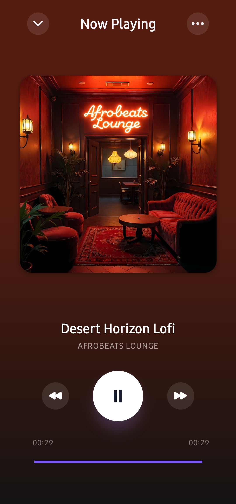
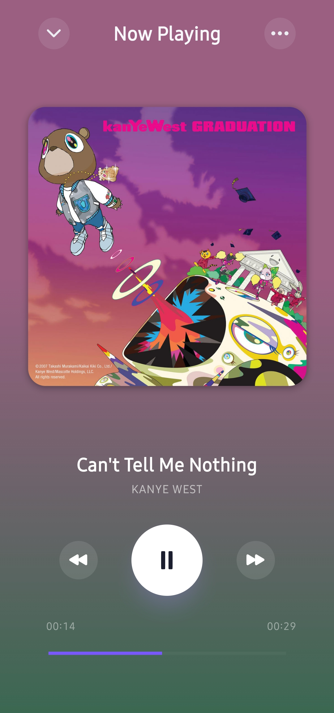
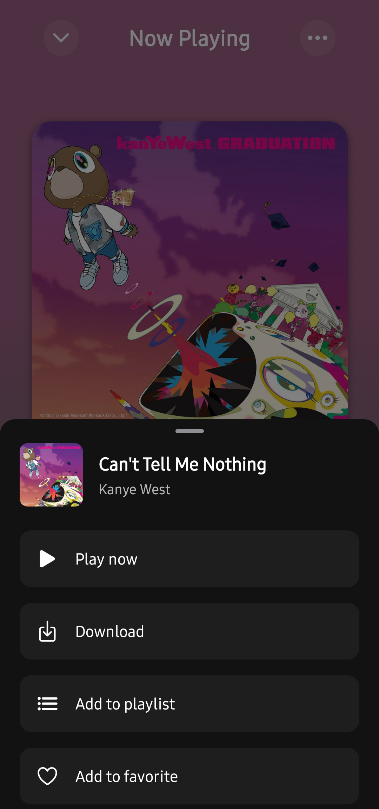
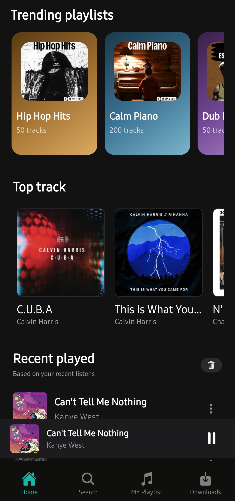
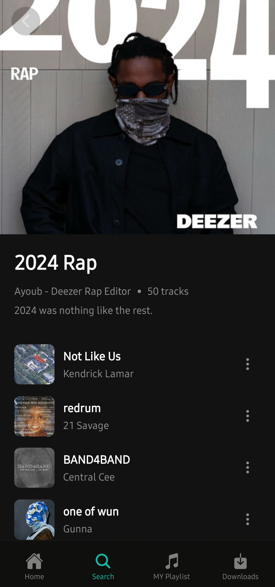
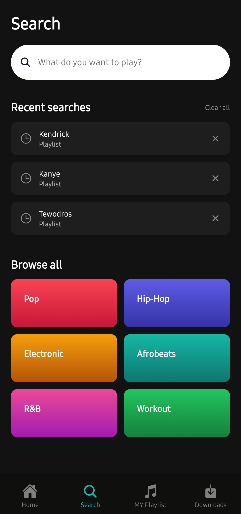

# Zema - Music Streaming App

A modern React Native music streaming application built with Expo, featuring offline playback, playlist management, and a beautiful UI

## 📲 Download

<div align="center">
  <a href="https://github.com/Tewodros-Tilahun-01/zema/releases/download/v1.0.0/application-fd7196b0-6698-4cc5-ad64-ab1a3ae4a42b.apk">
    
  </a>
  
  ### [⬇️ Download APK (v1.0.0)](https://github.com/Tewodros-Tilahun-01/zema/releases/download/v1.0.0/application-fd7196b0-6698-4cc5-ad64-ab1a3ae4a42b.apk)
  
  **Compatible with most Android devices**
</div>

## Features

- 🎵 Stream music from Deezer API
- 🎨 Beautiful UI with dark mode support
- 💾 Offline downloads and playback
- 📚 Create and manage playlists
- 🔍 Advanced search (tracks, artists, playlists)
- 🎧 Audio player
- 📊 Recently played tracks
- ⭐ Favorites collection
- 🎭 Dynamic theme colors from album artwork

---

## 🛠️ Tech Stack

<div align="center">

| Category       | Technologies                                                                                                                                                      |
| -------------- | ----------------------------------------------------------------------------------------------------------------------------------------------------------------- |
| **Framework**  |                  |
| **Language**   |                                                                                  |
| **Navigation** |                                                                                      |
| **Styling**    |   |
| **State**      |                    |
| **Database**   |                             |
| **Audio**      |                                                                                        |
| **UI/UX**      |                      |

</div>

## 📸 Screenshots

<table align="center">
  <tr>
    <td></td>
    <td></td>
    <td></td>
  </tr>
  <tr>
    <td></td>
    <td></td>
    <td></td>
  </tr>
</table>

---

## 📂 Project Structure

```
├── app/                    # Expo Router pages
│   ├── (auth)/            # Authentication screens
│   ├── (screen)/          # Additional screens
│   ├── (tabs)/            # Tab navigation screens
│   │   ├── collection/    # Collection management
│   │   ├── home/          # Home feed
│   │   ├── search/        # Search functionality
│   │   └── library.tsx    # Library screen
│   ├── _layout.tsx        # Root layout
│   └── index.tsx          # Entry point
├── components/            # React components
│   ├── artist/           # Artist-related components
│   ├── collection/       # Collection components
│   ├── common/           # Shared components
│   ├── home/             # Home screen components
│   ├── Modal/            # Modal components
│   ├── player/           # Audio player components
│   ├── playlist/         # Playlist components
│   ├── screens/          # Screen-specific components
│   └── search/           # Search components
├── db/                   # Database layer
│   ├── client.ts         # SQLite client
│   ├── migrations.ts     # Database migrations
│   ├── queries.ts        # Database queries
│   └── schema.ts         # Drizzle schema definitions
├── hooks/                # Custom React hooks
├── store/                # Zustand stores
│   ├── apiErrorStore.ts  # API error handling
│   ├── playerStore.ts    # Audio player state
│   └── trackOptionsStore.ts
├── config/               # Configuration files
├── types/                # TypeScript type definitions
├── utils/                # Utility functions
├── assets/               # Static assets (images, fonts)


```

## Database Schema

The app uses SQLite with the following tables:

- **recently_played**: Track playback history
- **recent_searches**: Search history
- **collections**: User playlists and system collections
- **collection_tracks**: Tracks within collections
- **downloads**: Offline downloaded tracks

## 🚀 Getting Started

### Prerequisites

Before you begin, ensure you have the following installed:

- **Node.js** (v18 or higher) - [Download](https://nodejs.org/)
- **npm** or **yarn** - Package manager
- **Expo CLI** - `npm install -g expo-cli`
- **iOS Simulator** (Mac only) - Xcode required
- **Android Studio** - For Android development

### Installation

1. **Clone the repository**

   ```bash
   git clone https://github.com/tewodrostilahun01/zema.git
   cd zema
   ```

2. **Install dependencies**

   ```bash
   npm install
   ```

3. **Start the development server**

   ```bash
   npm start
   ```

4. **Run on your preferred platform**

   ```bash
   # iOS (Mac only)
   npm run ios

   # Android
   npm run android

   # Web
   npm run web
   ```

### Development Commands

```bash
# Start Expo dev server
npm start

# Run linter
npm run lint

# Clean cache and reset
npm run reset-proj        # Static assets
│   ├── images/          # App icons and images
│   └── audio/           # Audio files
├── android/              # Android native code
├── ios/                  # iOS native code (generated)
└── audio/                # Audio resources
```

---

## 🗄️ Database Schema

The app uses SQLite with Drizzle ORM for type-safe database operations:

| Table               | Description                                                  |
| ------------------- | ------------------------------------------------------------ |
| `recently_played`   | Track playback history with timestamps                       |
| `recent_searches`   | User search history by mode (track/artist/playlist)          |
| `collections`       | User playlists and system collections (favorites, downloads) |
| `collection_tracks` | Tracks within collections with position ordering             |
| `downloads`         | Offline downloaded tracks with local file URIs               |

---

## 🚀 Getting Started

### Prerequisites

Before you begin, ensure you have the following installed:

- **Node.js** (v18 or higher) - [Download](https://nodejs.org/)
- **npm** or **yarn** - Package manager
- **Expo CLI** - `npm install -g expo-cli`
- **iOS Simulator** (Mac only) - Xcode required
- **Android Studio** - For Android development

### Installation

1. **Clone the repository**

   ```bash
   git clone https://github.com/tewodrostilahun01/zema.git
   cd zema
   ```

2. **Install dependencies**

   ```bash
   npm install
   ```

3. **Start the development server**

   ```bash
   npm start
   ```

4. **Run on your preferred platform**

   ```bash
   # iOS (Mac only)
   npm run ios

   # Android
   npm run android

   # Web
   npm run web
   ```

### Development Commands

```bash
# Start Expo dev server
npm start

# Run linter
npm run lint

# Clean cache and reset
npm run reset-project

# Build for production
eas build --platform android
eas build --platform ios
```

---

## 🏗️ Architecture & Implementation

### 🎵 Audio Playback System

- **State Management**: Centralized player state with Zustand (`playerStore.ts`)
- **Playback Control**: Custom hook `useTrackPlayer` for audio operations
- **Background Audio**: Continues playing when app is minimized

### 💾 Offline-First Architecture

- **Local Storage**: SQLite database with Drizzle ORM
- **Download Management**: Track downloads with metadata and file management
- **Smart Caching**: Automatic fallback to cached content when offline
- **Sync Strategy**: Background sync when connection is restored

### 📚 Collections & Playlists

- **System Collections**: Pre-built Favorites and Downloads collections
- **User Playlists**: Create, edit, delete custom playlists
- **Track Management**: Add/remove tracks with position ordering
- **Cover Generation**: Dynamic playlist covers from track artwork

### 🔍 Search Engine

- **Multi-Mode Search**: Tracks, artists, playlists, and albums
- **Debounced Input**: Optimized API calls with 300ms debounce
- **Search History**: Recent searches stored locally
- **Genre Discovery**: Browse music by genre categories

### 🎨 UI/UX Design

- **Dynamic Theming**: Color extraction from album artwork using `react-native-image-colors`
- **Smooth Animations**: 60fps animations with Reanimated 4
- **Gesture Support**: Swipe, drag, and pan gestures with Gesture Handler
- **Bottom Sheets**: Modal interactions for track options and menus
- **Network Monitoring**: Real-time connection status with user alerts
- **Error Handling**: Graceful error states with retry mechanisms

---

## ⚙️ Configuration

### Environment Setup

- **App Configuration**: `app.json` - App name, bundle ID, permissions
- **Database**: `drizzle.config.ts` - SQLite and Drizzle ORM settings
- **Theme**: `config/theme.ts` - Color schemes and design tokens
- **TypeScript**: `tsconfig.json` - Compiler options and path aliases

### Build Configuration

- **EAS Build**: `eas.json` - Production, preview, and development builds
- **Android**: `android/` - Native Android configuration
- **iOS**: `ios/` - Native iOS configuration (generated on first build)

---

## 📜 Available Scripts

| Command                 | Description                               |
| ----------------------- | ----------------------------------------- |
| `npm start`             | Start Expo development server             |
| `npm run android`       | Build and run on Android device/emulator  |
| `npm run ios`           | Build and run on iOS simulator (Mac only) |
| `npm run web`           | Run web version in browser                |
| `npm run lint`          | Run ESLint for code quality               |
| `npm run reset-project` | Clean cache and reset project             |

---

## 📦 Key Dependencies

<details>
<summary><b>Core Framework</b></summary>

- `react` (19.1.0) - UI library
- `react-native` (0.81.5) - Mobile framework
- `expo` (~54.0.33) - Development platform
- `typescript` (~5.9.2) - Type safety

</details>

<details>
<summary><b>Navigation & Routing</b></summary>

- `expo-router` (~6.0.23) - File-based navigation
- `@react-navigation/native` (^7.1.8) - Navigation core
- `@react-navigation/bottom-tabs` (^7.4.0) - Tab navigation

</details>

<details>
<summary><b>State & Data Management</b></summary>

- `zustand` (^5.0.11) - Lightweight state management
- `@tanstack/react-query` (^5.90.21) - Server state management
- `drizzle-orm` (^0.45.1) - Type-safe ORM
- `expo-sqlite` (~16.0.10) - Local database

</details>

<details>
<summary><b>UI & Styling</b></summary>

- `nativewind` (^5.0.0-preview.2) - Tailwind CSS for React Native
- `tailwindcss` (^4.1.18) - Utility-first CSS
- `react-native-reanimated` (~4.1.1) - Animations
- `react-native-gesture-handler` (~2.28.0) - Gesture support
- `@gorhom/bottom-sheet` (^5.2.8) - Bottom sheet modals

</details>

<details>
<summary><b>Audio & Media</b></summary>

- `expo-audio` (~1.1.1) - Audio playback
- `expo-image` (~3.0.11) - Optimized images
- `react-native-image-colors` (^2.5.1) - Color extraction

</details>

<details>
<summary><b>Utilities</b></summary>

- `axios` (^1.13.6) - HTTP client
- `expo-file-system` (19.0.21) - File operations
- `@react-native-community/netinfo` (11.4.1) - Network status

</details>

---

## 🤝 Contributing

Contributions are welcome! Please feel free to submit a Pull Request.

1. Fork the project
2. Create your feature branch (`git checkout -b feature/AmazingFeature`)
3. Commit your changes (`git commit -m 'Add some AmazingFeature'`)
4. Push to the branch (`git push origin feature/AmazingFeature`)
5. Open a Pull Request

---

## 📄 License

This project is private and proprietary.

---

## 👨‍💻 Author

**Tewodros Tilahun**

- GitHub: [@Tewodros-Tilahun-01](https://github.com/Tewodros-Tilahun-01)
- Email: tewodrostilahun.dev@gmail.com

---

## 🙏 Acknowledgments

- Music data provided by [Deezer API](https://developers.deezer.com/)
- Built with [Expo](https://expo.dev/)
- UI inspired by modern music streaming platforms
- Icons from [@expo/vector-icons](https://icons.expo.fyi/)

---

<div align="center">
  
  **Made with ❤️**
  
  If you found this project helpful, please consider giving it a ⭐
  
</div>
